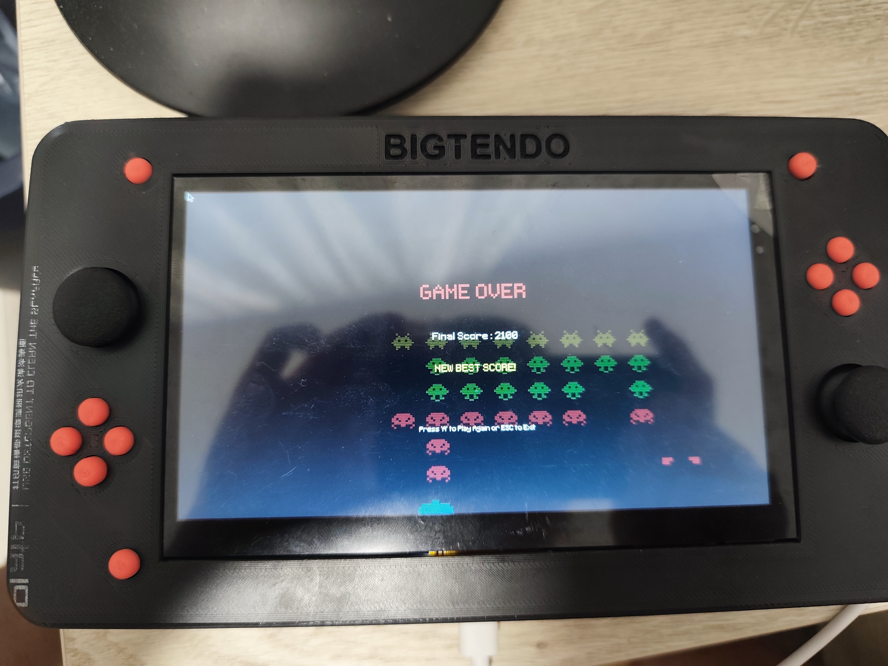
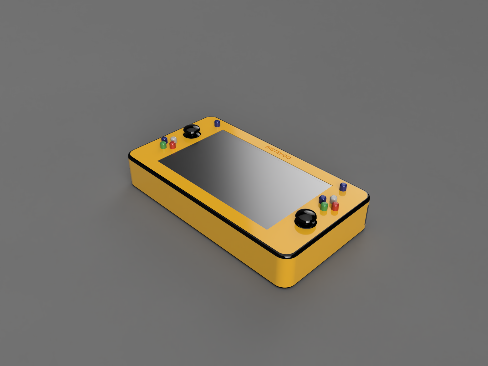
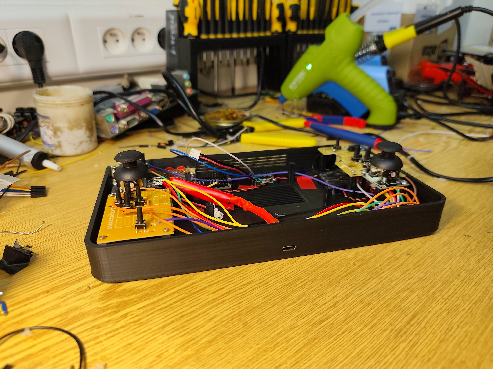
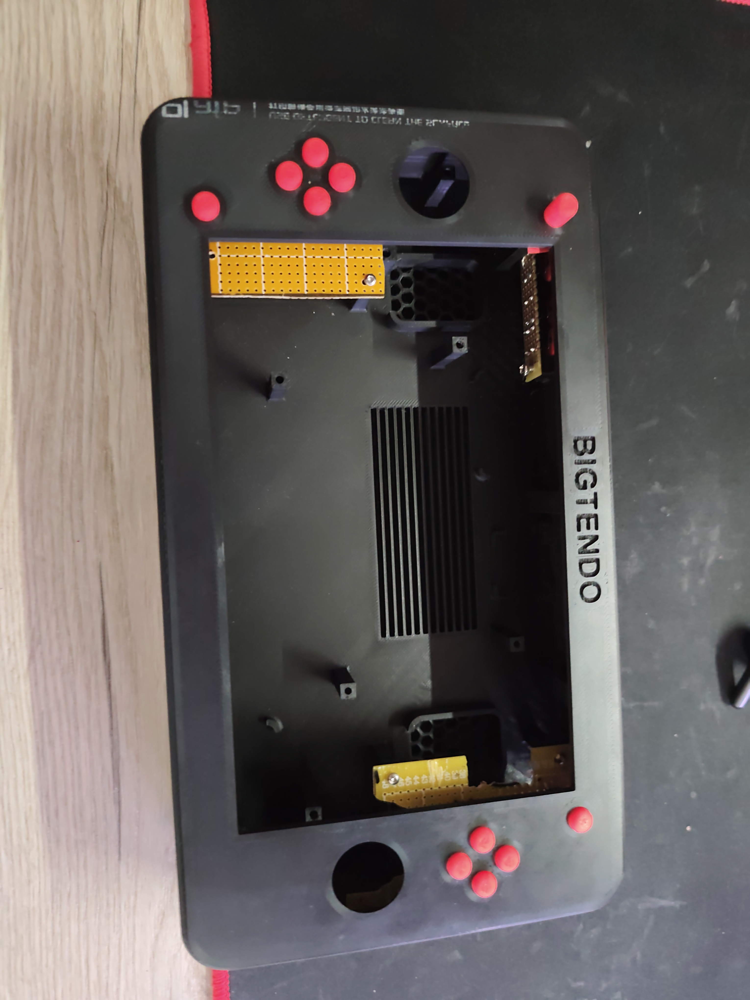
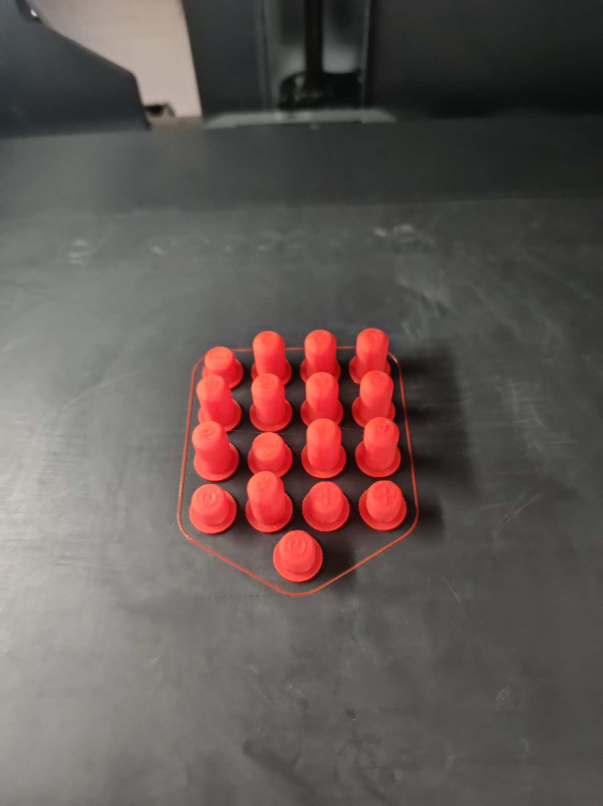
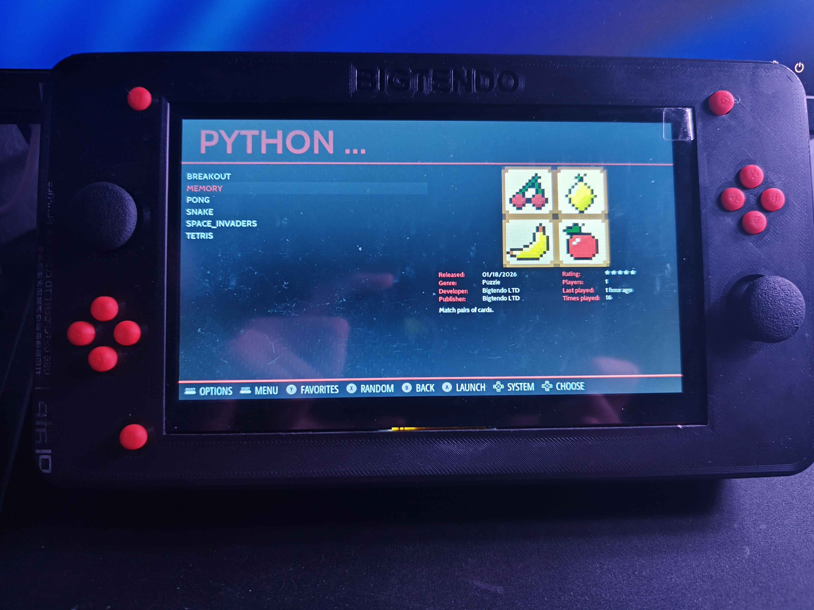
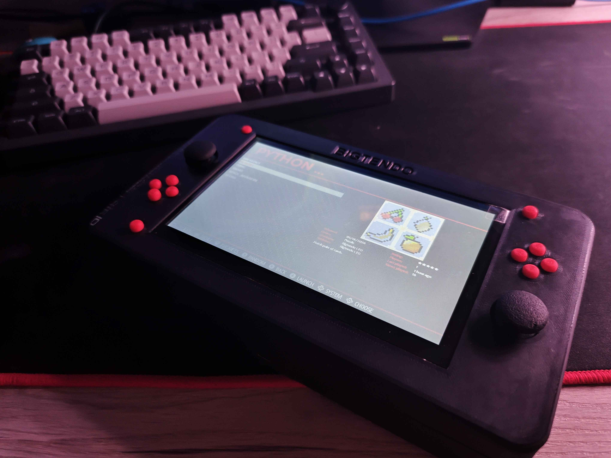
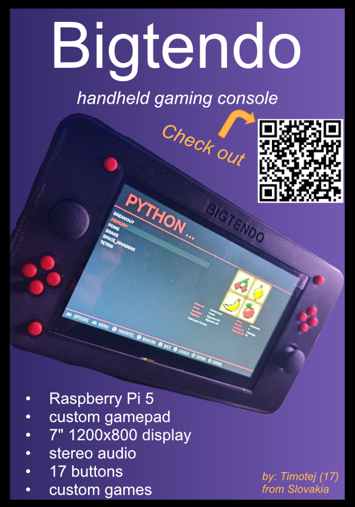

# Bigtendo Handheld SBC

A portable gaming console built from scratch around a Raspberry Pi 5 and an Adafruit Feather RP2040. It runs RetroPie for retro game emulation and original games written in Pygame and Godot, all controlled with analog joysticks and physical buttons through a custom USB-HID gamepad interface. The whole thing lives inside a 3D-printed two-part enclosure designed in Fusion 360.

The console combines a Raspberry Pi 5 running RetroPie with a separate microcontroller (Feather RP2040) that handles all gamepad input. The RP2040 reads two analog joysticks and 17 physical buttons, applies calibration and deadzone logic, and presents itself to the Pi as a standard USB-HID gamepad, meaning every piece of software on the Pi (EmulationStation, RetroArch, pygame, Godot) sees it as a normal controller with zero extra configuration.

Audio goes through an I2S DAC (Adafruit PCM5122) into a PAM8403 Class D stereo amplifier driving two small cavity speakers. Power comes from a Suptronics X1201 UPS HAT with dual 18650 Li-Ion cells.



---

### Why We Built It

We wanted to understand how a real consumer device works, from the PCB-level electronics to the operating system configuration and to the mechanical design. Buying a kit or following a tutorial wouldn't teach us that. Every part of this console forced us to learn something new: I2S audio protocols, USB-HID protocol, device tree overlays, 3D printing tolerances, soldering, and a lot of debugging.

We are currently designing a custom PCB to combine the audio DAC, amplifier, controller logic, and battery management onto a single board, replacing both the perfboard wiring and the UPS HAT, significantly reducing the internal complexity, size and making the whole build cheaper than buying a standalone UPS module.

### How to Use It

The console boots directly into EmulationStation, RetroPie's game browser. Use the D-pad and A/B buttons to navigate and launch games. Retro games run through RetroArch emulators, and our custom pygame and Godot titles launch the same way through the Ports section, everything is accessible from one menu. The gamepad shows up as a standard USB controller, so it also works if you plug the Feather into any PC. Pick it up to play some games, or use it as a hands-on platform for learning embedded systems, hardware design, Linux configuration, and game development.

---

## Photos

| | |
|:---:|:---:|
|  |  |
|  |  |
|  |  |

---

## Hardware

| Component | Details |
|---|---|
| **Compute** | Raspberry Pi 5 (8GB RAM), RetroPie OS |
| **Controller** | Adafruit Feather RP2040, USB-HID gamepad with auto-calibration, deadzone, axis inversion/swap |
| **Inputs** | 2x analog joysticks, 17x tactile buttons (D-pad, A/B/X/Y, Start/Select/Home, shoulders) |
| **Audio** | Adafruit PCM5122 I2S DAC, PAM8403 Class D amp, 2x 2030 cavity speakers (8 ohm, 2W) |
| **Power** | Suptronics X1201 UPS HAT + 2x 18650 Li-Ion cells |
| **Display** | 7" HDMI touchscreen (1024x600) |
| **Enclosure** | 3D-printed PLA, ~245 x 135 x 45mm, Bambu Lab X1 Carbon |

---

## Repository Structure

Each folder has its own README with more detail.

```
├── Design/          ← CAD models (.f3d, .step, .stl), assets (icons, sprites, sounds)
├── Firmware/        ← Feather RP2040 CircuitPython controller firmware
├── Games/           ← Pygame and Godot titles
├── Docs/            ← Build guide, wiring guide, pin mapping
├── Media/           ← Build photos and screenshots
├── BOM.csv          ← Bill of materials with purchase links
└── README.md        ← You are here
```

---

## How to Build

Full instructions in **[Docs/build_guide.md](Docs/build_guide)** and **[Docs/wiring_guide.md](Docs/wiring_guide)**. Print the case, flash the Feather, wire everything, configure the Pi, assemble, and play.

---

## Built By

- **[@Klesp0](https://github.com/Klesp0)** - Hardware, CAD, electronics, firmware, audio, assembly
- **[@lukas513](https://github.com/lukas513)** - Games (Pygame and Godot), co-designed enclosure
- **[@A-Kosec](https://github.com/A-Kosec)** - Pygame games, game design, visual assets, configuring retropie

---

## License


